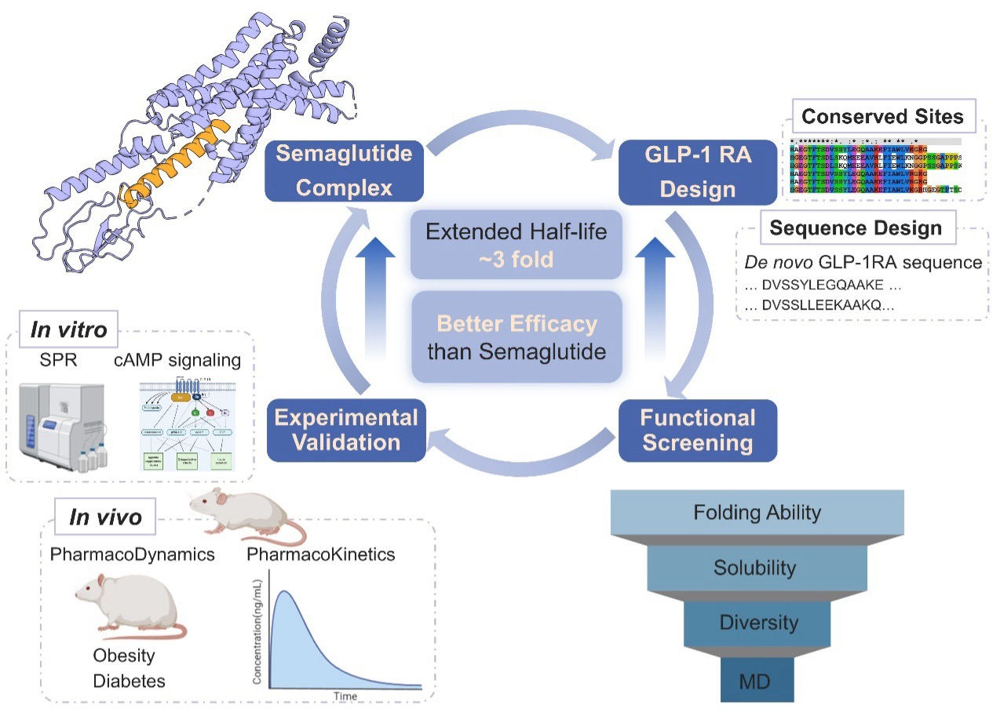

# GLP_1RA_design
[](https://www.biorxiv.org/content/10.1101/2025.03.26.645438v1)


Accompanied in silico analysis codebase for paper [AI-driven efficient *de novo* design of GLP-1RAs with extended half-life and enhanced efficacy](https://www.biorxiv.org/content/10.1101/2025.03.26.645438v1). 



## Description

We conducted an *in silico* pipeline for the design of GLP-1RAs. The codebase is organized as follows:

* `./envs` contains the environment dependencies.
* `./step1_ProteinMPNN_Design` fixed 13 conserved sites and then used ProteinMPNN to design the remaining 18 sites.
* `./step2_Functional_Screening` includes the virtual screening based on stability, efficacy, and diversity criteria


## Documentation

### Step 1:  De novo GLP-1RAs Design
#### Design
We first defined 13 conserved sites (7H, 8Aib, 9E, 10G, 11T, 12F, 13T, 14S, 15D, 17S, 26K, 34R, 37G) of GLP-1RAs, those amino acid types were fixed during the design using [ProteinMPNN](https://github.com/dauparas/ProteinMPNN.git). Your should firstly install the ProteinMPNN and then run the shell script [submit_glp.sh](https://github.com/Immortals-33/GLP_1RA_design/blob/main/step1_ProteinMPNN_Design/submit_glp.sh) 
* `sh submit_glp.sh`
  
#### Structure Prediction
We then used [AlphaFold2](https://github.com/google-deepmind/alphafold) to predict those structures used for further screening. 

Our filtering pipeline could also be extended to hold arbitrary sequence designers and structure predictors beyond ProteinMPNN and AF2 in general.

#### Installation
You can set up a conda environment used for proteinMPNN design
* `conda create --name mlfold` - this creates conda environment called mlfold.
* `source activate mlfold` - this activate environment.
* `conda install pytorch torchvision torchaudio cudatoolkit=11.3 -c pytorch` - install pytorch following steps from https://pytorch.org.

### Step 2: Functional Screening

* Stability: To improve stability and extend the half-life of the designed GLP-1RAs, sequences containing these cleavage sites were filtered out. we further filter the designed GLP-1RAs based on the net charge and spatial aggregation propensity (SAP) score.
* Efficacy: AlphaFold2 was used to predict the complex structures of the designed GLP-1RA sequences and GLP-1R. pLDDT evaluate the quality of the predicted protein structure and RMSD assess how well the designed structure aligns with the native structure
* Diversity: The similarity between designed sequences and the approved drug remained below the threshold defined by relevant patents.  Phylogenetic trees were generated to categorize sequences, and a single representative sequence was selected in each phylogenetic cluster

<details>
    <summary>Expand</summary>

#### Motif-RMSD and pLDDT

When calculating the motif-RMSD using the [script](https://github.com/Immortals-33/GLP_1RA_design/blob/main/step2_Functional_Screening/motif_rmsd_plddt.py) you should prepare the following information:

* `DESIGN_PATH` is the path storing your designed PDBs. Suppose you have $N$ designed proteins, you should assign an ID for each design like `{protein_name}_1,`, `{protein_name}_2`, ..., `{protein_name}_$N$` with the name of protein and the ID separated by `_` .  
* `REFERENCE_PDB` is the reference protein you used to calcualte the motif-RMSD with. 
* `DESIGN_MOTIF` is a `.txt` file containing the corresponding motifs to be calculated. Each protein takes a line, where the **ID ** and motif number is separated by a **tab character** by default.
* `REFERENCE_MOTIF` is the `.txt` file containing the information of reference motif following the logic aforementioned. 

By then you can use the script to filter the designed proteins. For example, the following command aims to filter the proteins whose pLDDT > 80 and motif-RMSD compared with the native ones < 1.0 Å:

```
python motif_rmsd_plddt.py \
-d /dssg/home/acct-clschf/clschf/weiting/GLP/AF2/output \
-r 7ki0_new.pdb \
--motif_d motif.txt \
--motif_r motif_com.txt \
--root-path /dssg/home/acct-clschf/clschf/weiting/GLP/filter/AF2_rmsd_plddt \
--rmsd 2.0
```

#### SAP (Spatial Aggregation Propensity)  

Since calculating SAP depends on [PyRosetta](https://www.pyrosetta.org/), we recommend using a separate conda environment:

```
conda env create -f envs/pyrosetta.yml
source activate PyRosetta
```

You can then use the following command and [script](https://github.com/Immortals-33/GLP_1RA_design/blob/main/step2_Functional_Screening/sap.py) to filter designed proteins either based on the comparison with reference PDB or a specific value:

```
# This will keep the designed proteins with SAP scores lower than the native
python sap.py \
       -d DESIGN_PATH
       -r REFERENCE_PDB
       
# This will keep the designed proteins with SAP scores < 20
python sap.py \
       -d DESIGN_PATH
       --sap 20.0
```
</details>

## Citation

If you have used the code in your research, please cite:

```bibtex
@article{wei2025ai-driven,
title = {AI-Driven Efficient De Novo design of GLP-1RAs with Extended Half-Life and Enhanced Efficacy},
author = {Ting, Wei and Xiaochen, Cui and Jiahui,Lin and Zhuoqi,Zheng and Taiying, Cui and Liu, Cheng and Xiaoqian, Lin and Junjie, Zhu and Xuyang,Ran and Xiaokun,Hong and Zhangsheng, Yu and Haifeng, Chen},
year = {2025},
journal = {bioRxiv},
url = {https://www.biorxiv.org/content/10.1101/2025.03.26.645438v1}
}
```

***

## Acknowledgements
* https://github.com/dauparas/ProteinMPNN
* https://github.com/Immortals-33/FPP
* https://github.com/google-deepmind/alphafold

